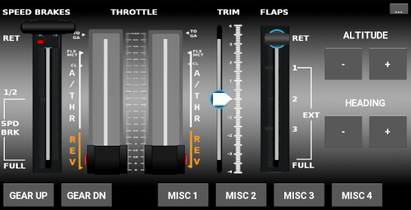

Mobile flight panel
===================

This is an app + associated desktop software that allows you to use your
phone as a flight panel touchscreen instead of spending lots of money on a
physical one. Check it out:

This is a Kivy application that sends UDP packets to your computer. On your
Windows computer you run an included python script to listen for the packets
and change a vJoy virtual joystick.

I've used the application successfully with Windows 10 + vJoy 2.1.9.1 +
Microsoft Flight Simulator 2020 and an Android 6.0 phone. In theory,
anything that can utilize a virtual joystick on Windows would be able
to use this.

Installation of this application is geared towards technical users, please
figure it out yourself and then update the documentation in this README 
for others.

Usage
=====

First, install vJoy on your computer, and set up a virtual joystick.

* See https://github.com/shauleiz/vJoy or https://github.com/jshafer817/vJoy

Then, deploy the Kivy application on your phone using buildozer (see below).
I do not currently plan to distribute this on an app store, so you'll have to
use the relevant developer tools to build/deploy the app.

Once you have the application installed, then you'll want to install Python 3
on your Windows computer, and run the 'vjoy_feeder.py' python script. Figure
out your computer's IP address and record it ('ipconfig' works well from the
command line).

When the feeder application starts, you may be prompted by your firewall. If
you don't enable the app, it won't work.

Once the feeder is running, you can start the app on your phone. Click the '...'
settings thing, and enter in the IP address of your computer. You can use
the vJoyConf application to verify that joystick buttons/axis are occurring.

Android deploy
--------------

At a high level, you need to:

* Install python 3
* Install buildozer + requirements
* Deploy the app to your phone via `buildozer android debug deploy run`

See the [Kivy Android documentation](https://kivy.org/doc/stable/guide/android.html)
for in depth documentation about this process.

iOS deploy
----------

TODO: I don't have an iPhone, but in theory this should work?

Local development
-----------------

I've been running the application on Linux like so:

    python main.py -m screen:onex,scale=.75 -m inspector

Joystick axis/button mapping
============================

See `axis_map` and `button_map` in [main.py](main.py). Or set everything
up and use the vJoyConf application to observe each button.

Frequently asked questions
==========================

### I have this great idea! What if... ?

This app is open source, so you should totally implement the idea and make a
pull request so others can benefit! I'm happy to accept pull requests.

However, it's likely that I'm not going to spend any time implementing things
I don't care about. The odds that I care about your feature request are not
great.

### How do I configure my flight simulator?

It should see the vJoy virtual device as an additional device. Tell it to use
it, then configure the buttons/axis as you wish.

### Why did you choose those buttons/settings? 

The original app I adapted this from used them, and honestly I don't know
a lot about flight simulators. Feel free to improve it.

### The background image sucks! Can I change it? 

Yes! Use GIMP to edit images/bg-xhdpi.xcf. It has layers and stuff.

### It doesn't work?

Yes it does.

Credit
======

This is heavily adapted from the work already done by the original authors of the
[flightgear-tq-panel](https://gitlab.com/flightgear-tq-panel-made-with-kivy/flightgear-tq-panel-made-with-kivy.git)
project.

I merely adapted the application to send data to a vJoy feeder application and
changed the background to work with an XHDPI screen.

License
=======

Copyright (C) 2020 Dustin Spicuzza

This program is free software: you can redistribute it and/or modify
it under the terms of the GNU General Public License as published by
the Free Software Foundation, either version 3 of the License, or
(at your option) any later version.

This program is distributed in the hope that it will be useful,
but WITHOUT ANY WARRANTY; without even the implied warranty of
MERCHANTABILITY or FITNESS FOR A PARTICULAR PURPOSE.  See the
GNU General Public License for more details.

You should have received a copy of the GNU General Public License
along with this program.  If not, see <https://www.gnu.org/licenses/>.
